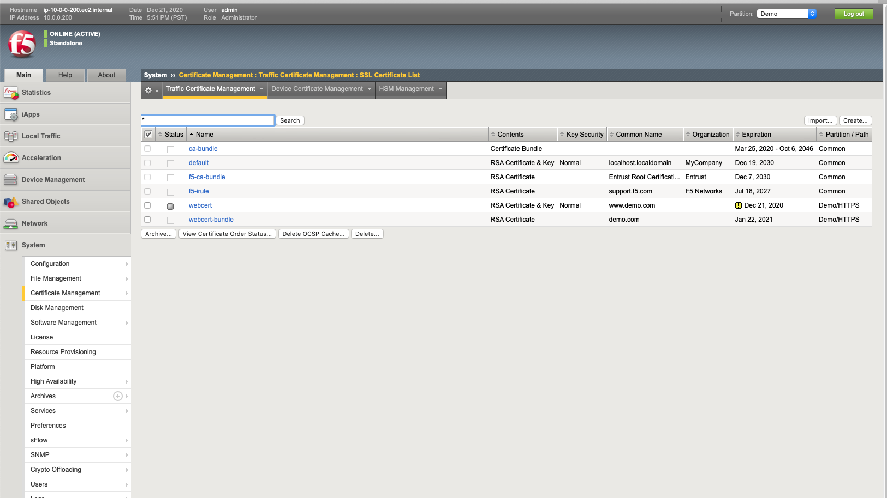

# Check BIG-IP Configuration

1. Open another web shell on the ubuntu server
login as ```udf```
password ```udf```

2. Change directory to bigip-vault
```cd bigip-vault```

```terraform output```

```F5_Password = BYgGlZroyQ```

```To_SSH_into_vault_ubuntu = ssh -i``` 

```terraform-20201222003422297000000001.pem ubuntu@54.147.163.209```

```f5_ui = https://54.243.26.27:8443```

```vault_ui = http://54.147.163.209:8200```

USe the F5 BIG-IP address to login into BIG-IP

Check below the certificates are being rotated every 160 secs



[GoTo Back to  Exercise-1](../../../../../../../../../../../../../../../1-ex)

[GoBack](../README.md)
