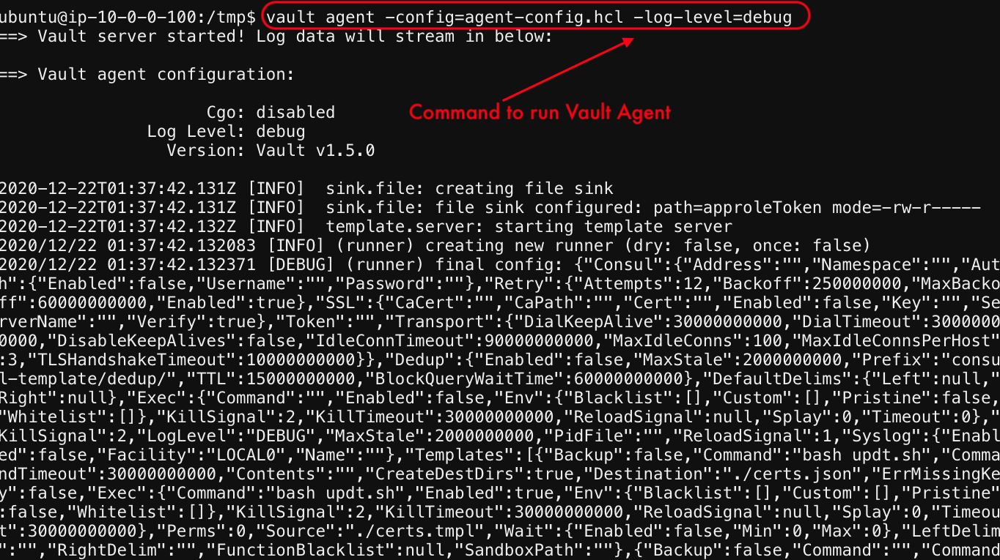
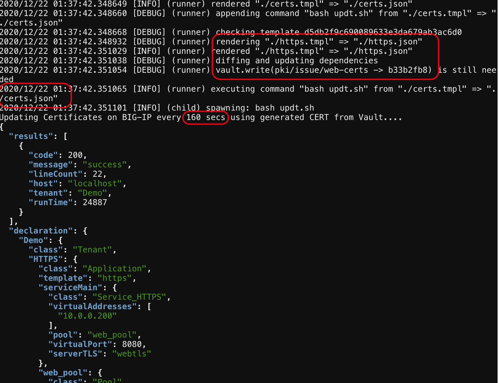

# Finally run the Vault Agent file...

1. Run the Agent file now this will dynamically update the SSL certificates for every 160 secs for ever !!!!!
As long as the script is running on the ubuntu server.
Run the Agent ```vault agent -config=agent-config.hcl -log-level=debug```




 

 
[GoTo Next Exercise-15](15-ex)

[GoBack](../README.md)
