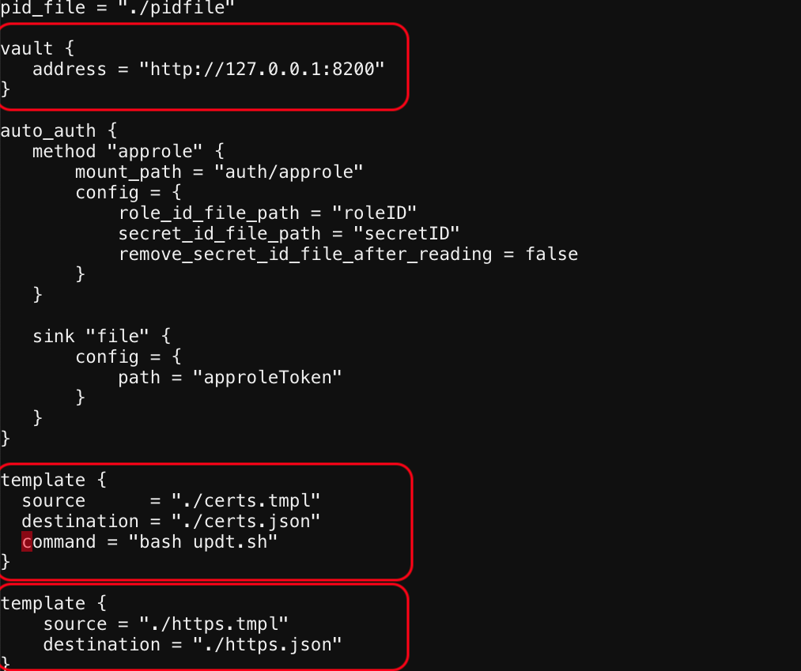

# Update the Vault Agent file
1. Update the Agent file so that it executes the ```command = "bash updt.sh"``` script
remove the '#' uncomment it.
Save the file



2. Lets review the updt.sh script

   

 
[GoTo Next Exercise-14](14-ex)

[GoBack](../README.md)
