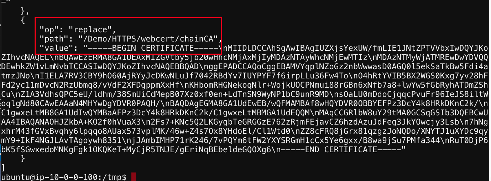

# Review the Cert.Json file created
1. Review the JSON file certs.json which got created dynamically

   

2. Notice the privatekey & CA chain certificates

   

[GoTo Next Exercise-13](13-ex)

[GoBack](../README.md)
