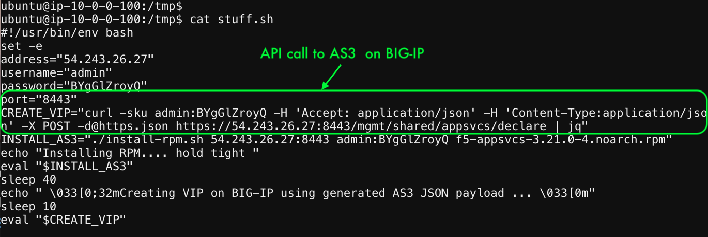

# Deploy AS3 Template on BIG-IP
1. Now since we have generated the JSON files we can use http.json to deploy the virtual server and Pools on the BIG-IP

2. Do a Contrl C on the Vault running agent and lets review the script to deploy http.json on BIG-IP

3. Review the stuff.sh file which deploys as3 rpm and does the configuration.

 
   

4. Execute the bash stuff.sh to deploy AS3 on BIG-IP

   

[GoTo Next Exercise-12](12-ex)

[GoBack](../README.md)
