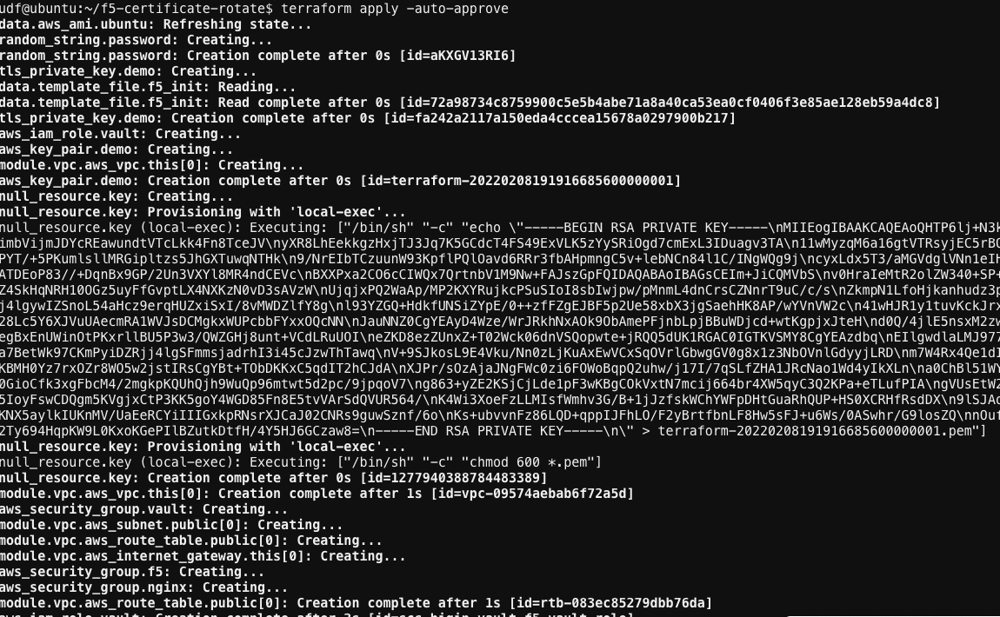
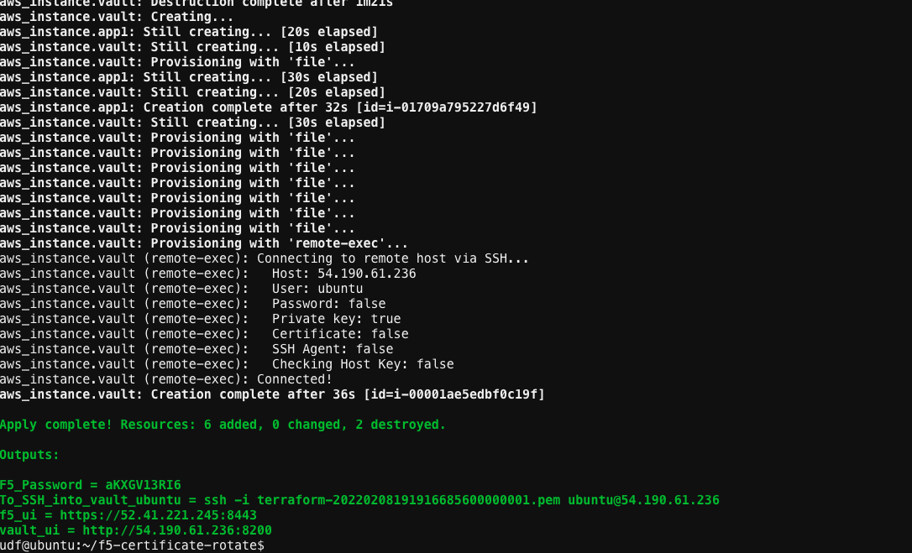

# Run the Vault Agent Command
``` vault agent -config=agent-config.hcl -log-level=debug ```
1. Below you can see the https.json and certs.json files being created dynamically,

 
   

   

[GoTo Next Exercise-11](11-ex)

[GoBack](../README.md)
