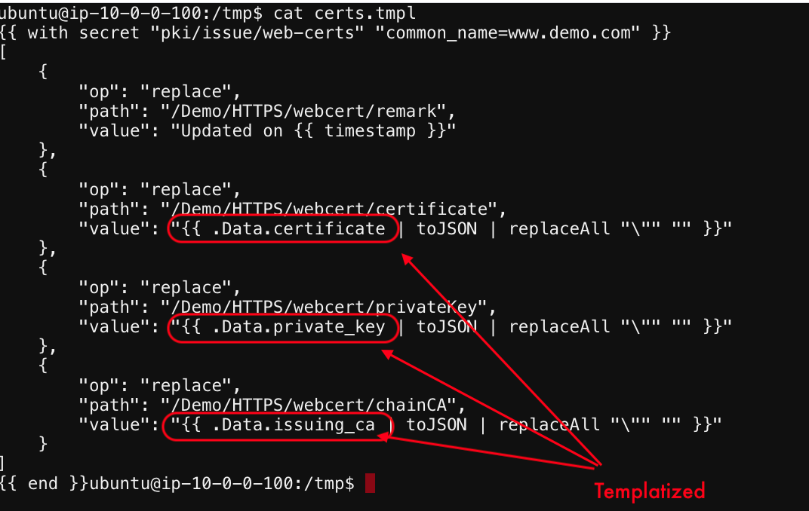
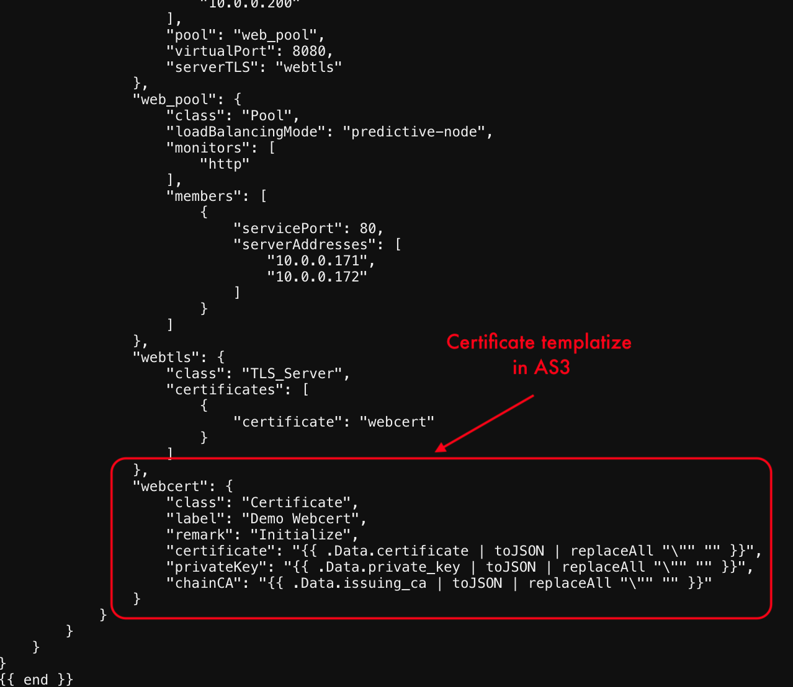

# Lets review the tmpl files.

1. The following values will be replaced dynamically and the cert.json & http.json will be created ```.Data.certificate .Data.private_key & .Data.issuing_ca```
   

   

[GoTo Next Exercise-10](10-ex)

[GoBack](../README.md)
