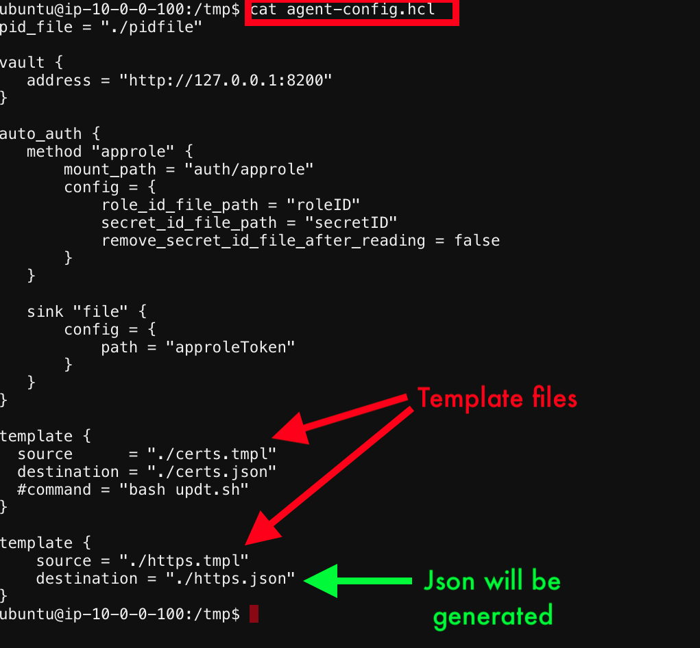

# Review the /tmp directory

   

   Notice the files ```.tmpl & .json```
   under the the ```template``` stanza
   The ```tmpl``` files are present already in the ```/tmp``` directory. The ```Json``` files are created when we execute the vault agent file, currently no json files are present.

   

[GoTo Next Exercise-9](9-ex)

[GoBack](../README.md)
