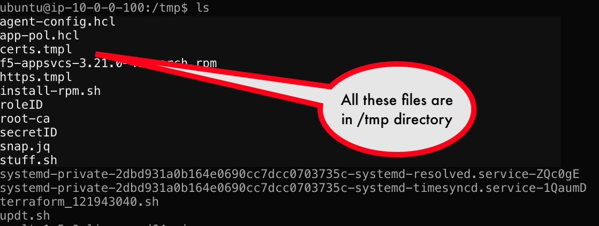

# Review the /tmp directory
Below is the agent file which we will be running, this has three main stanza

### vault
This points to the vault IP address

### auto_auth
We are using auth method in Vault as ```approle``` this is primarily use for app to app authentication, it uses ```roleID``` and ```secretID```these act like username and password to authenticate to vault. Once you get authenticated vault will provide the ```appRoleToken```

### template
This is used for templating, the source will use the ```tmpl``` file and the destination is the action taken, in this case it is generating a ```json``` file from the tml file

   

   Notice the files ```.tmpl & .json```
   under the  ```template``` stanza
   The ```tmpl``` files are present already in the ```/tmp``` directory. The ```Json``` files are created when we execute the vault agent file, currently no json files are present.

   

[GoTo Next Exercise-9](9-ex)

[GoBack](../README.md)
