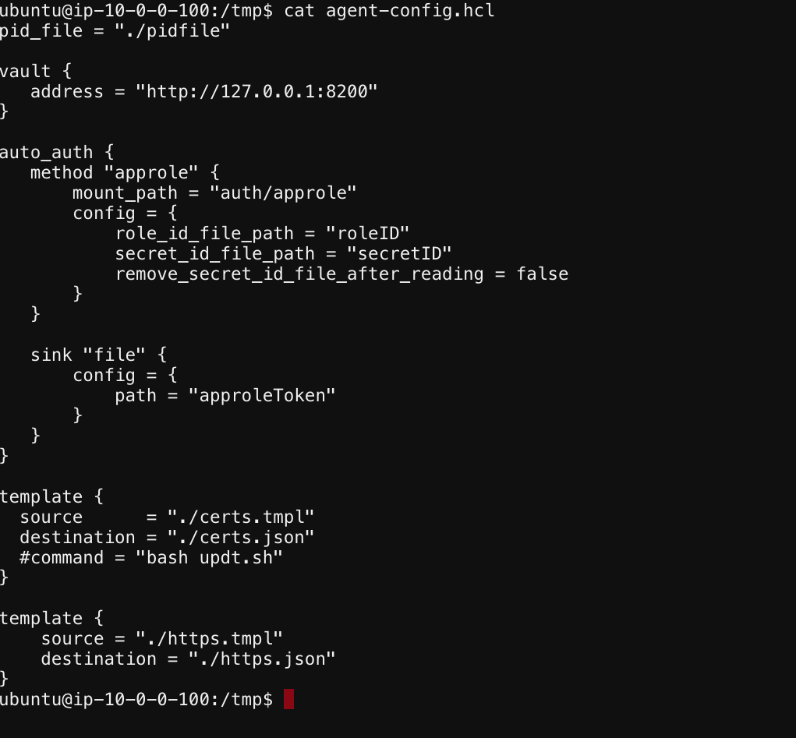

# Review the Vault Agent Config file


1. While you are already ssh to Vault server

2. Issue the commands
 
``` cd /tmp```
``` cat agent-config.hcl```

You will see the file as shown in the picture below

   

[GoTo Next Exercise-8](8-ex)

[GoBack](../README.md)
