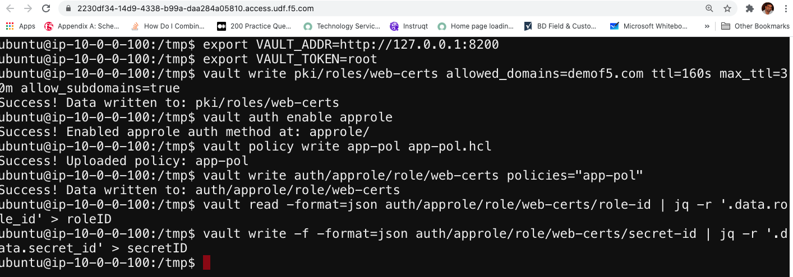
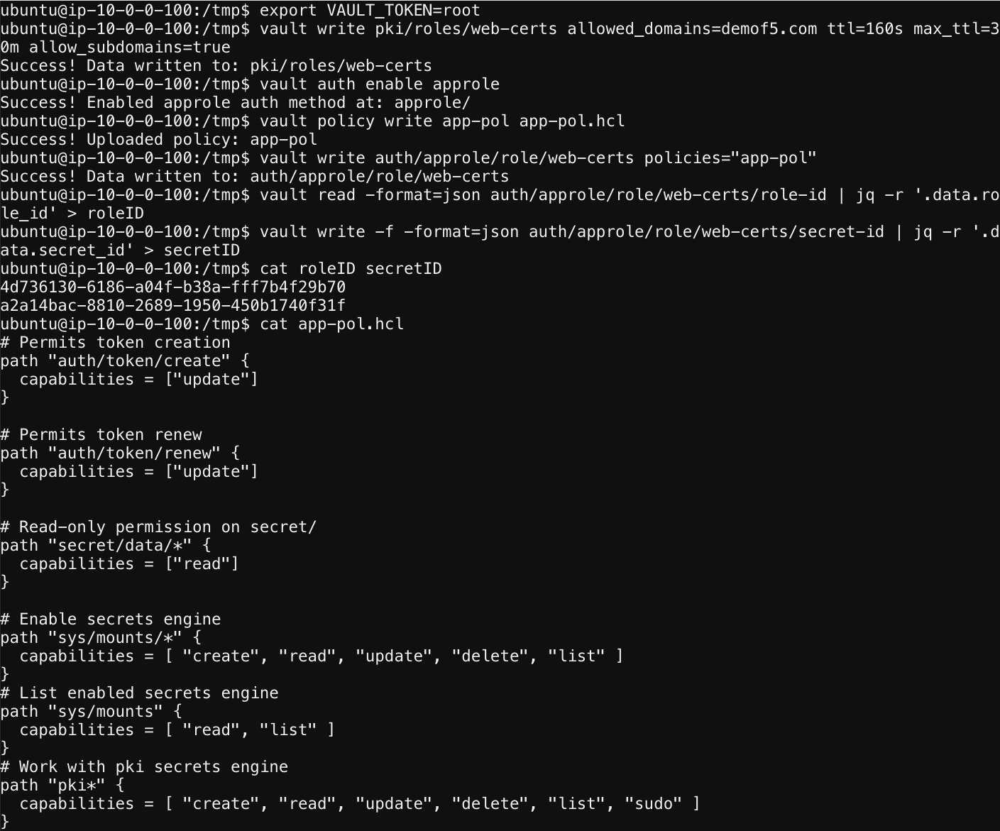

# Configure Vault Parameters


1. While you are already ssh to Vault server

2. Issue the commands
# Change the Dir to tmp as we have policy files located in the same directory
``` cd/tmp``` 
# Export the root token 
```export VAULT_TOKEN=root```
# PKI we have enabled in the vault.sh, here you are creating the role called web-certs domain name, TTL of 160s, this means the token will expire in 160secs 
```vault write pki/roles/web-certs allowed_domains=demof5.com ttl=160s max_ttl=30m allow_subdomains=true ```
# Enable the Approle Security Engine, usually used for machine to machine authentication or app authentication.
```vault auth enable approle```
# Here we are uploading the app policy to vault from temp directory
```vault policy write app-pol app-pol.hcl```
# Apply the policy to the app role
```vault write auth/approle/role/web-certs policies="app-pol"```
# Create the roleID from vault
```vault read -format=json auth/approle/role/web-certs/role-id | jq -r '.data.role_id' > roleID```
# Create the sceret ID from Vault
```vault write -f -format=json auth/approle/role/web-certs/secret-id | jq -r '.data.secret_id' > secretID```

   
   

[GoTo Next Exercise-6](7-ex)

[GoBack](../README.md)
