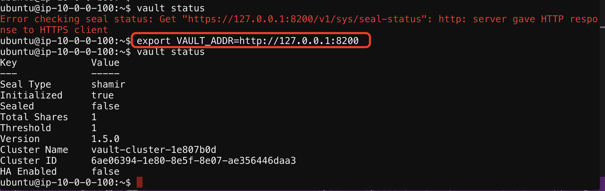

# Login into the Vault Server


1. Open the Web Shell if not open  and login to udf/udf

2. Change the directory ```cd f5-certificate-rotate```

3. Run ```terraform output``` if you don't see the ssh details of ubuntu

   

4. Run ```vault status``` you will see this error 

``` Error checking seal status: Get "https://127.0.0.1:8200/v1/sys/seal-status": http: server gave HTTP response to HTTPS client```

   

5. Now Configure the following
```export VAULT_ADDR=http://127.0.0.1:8200```

then do  ```vault status```


[GoTo Next Exercise-6](6-ex)

[GoBack](../README.md)
