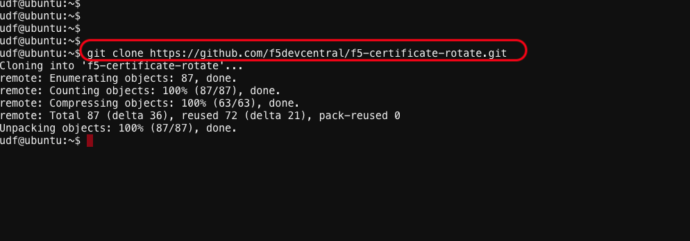

# Setup AWS Access Key & Secret Key


1. Click on **Cloud Accounts** tab on the UDF Blue print

2. Copy the **API Key** & **API Secret key**

3. Go to the ubuntu UDF Shell and configure the following

```
 aws configure

    AWS Access Key ID [****************CGGT]:XXXXXXXXXXXXX

    AWS Secret Access Key [****************QmTY]:XXXXXXXXXXX
```
you can also export the keys if you wish.

4. Execute 
``` git clone https://github.com/f5devcentral/f5-certificate-rotate.git ```

   
   
5. Change directory to ```cd f5-certificate-rotate ``` and execute 

   ```terraform init```

   ```terraform plan```

   ```terraform apply -auto-approve```
 
   
   

## Note :: You might get an error 
``` Error launching source instance: OptInRequired: In order to use this AWS Marketplace ```

6. Copy the link To do so please visit https://aws.amazon.com/marketplace/pp?sku=3ouya04g99e5euh4vbxtao1jz

7. Login to AWS Console by going to UDF Blueprint –> Cloud Accounts –> Console URL

8. Use the https link above `OptInRequired: In order to use this AWS Marketplace product you Erro
r
9. Click on https://console.aws.amazon.com/marketplace/home?region=us-west-2#/subscriptions/U1VCU0NSSVBUSU9OQEBAOTI5Y2EwZDgtYzJkNy00MDY4LThmOWEtZWI3NWE2NzdhZmVk

or

10. search for F5 BIG-IP Virtual Edition - BEST (PAYG, 1Gbps)

11. Sunsbcribe to the trial service and Accept all terms.

[GoTo Next Exercise-3](3-ex)

[GoBack](../README.md)
